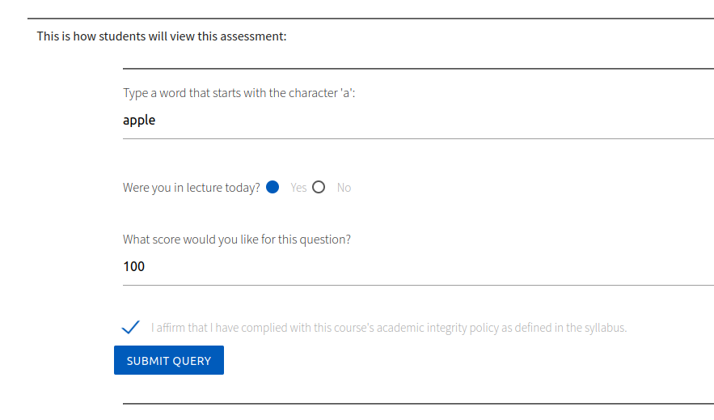

# Create an Autograder

This is arguably the most important feature of Autolab. An autograder will run automatically after a student makes a
submission to an assessment. As an instructor, you will write code that grades a student's submission. When a student
submits their work, it will be copied into a Docker container, along with your grading files and some metadata. Your
code should interact with the student's submission in some way to determine its correctness. You can print feedback to
stdout for the student to see. The final line you print must be a JSON string with the student's scores for each problem
in the assessment.

## Setup

### Create an assessment

Start by creating an assessment as described in the [Create an Assessment](Create%20an%20assessment.md) guide.

From the assessment page, click `Edit assessment`.


### Set the handin filename

Choose the handin filename from the "Handin" tab. This is the name of the file that your autograder will
need to interact with. The extension is an important hint about what type of file students should upload. In this
simple grader, I'll have the students upload a Python script.

> ### Have a multi-file project?
> Since students can only submit one file, it's common to request they upload a .zip or .tar.gz archive for larger
> projects. Then, your grader can decompress the archive and have access to all the files.


### Add some problems

From the `Problems` tab, add some problems that will be graded by our autograder.


> ### Save your changes
> Remember, Autolab doesn't apply most settings immediately. You'll need to click `Save` at the bottom of the page after
> making these changes.

### Add an autograder

From the `Basic` tab, scroll down to the "Modules Used" section, and click the plus next to "Autograder".


1. Choose a VM image to use. This is the Docker image that your container will be built from. The `autograding_image` is
   a good choice for Python projects.
    * You can see all the Dockerfiles for Autolab's VM images in our
      previous [Tango Repository](https://github.com/UBAutograding/Tango/tree/master/vmms). If you need a custom image,
      you can create one and make a pull request to that Tango repository. Then, contact CSE IT to build the image and
      add it to Autolab. Try to use an existing image if possible.
2. Choose the timeout for the autograder. This is the maximum amount of time your autograder will be allowed to run. If
   grading takes longer than this, the student will receive partial feedback and an error saying that Autolab couldn't
   parse the output from your grader.
    * Our new hardware as of fall 2023 is much faster, and many jobs finish in under 10 seconds. I recommend uploading
      your own solution to the assessment and running it to get an idea of how long it takes to run. Then, at your
      discretion, add some time to account for performance variation and inefficient submissions.
    * If you want to grade based on runtime, this is not the way to do it. You'll need to implement the timeout feature
      within your grader. Since there's variation between runs, consider even timing your solution within the same
      container and adjust the expected runtime dynamically.
3. Click `Save Settings`. We'll come back to this page later to upload the grader.


## A Minimal Autograder

An Autograder is composed of two files: a Makefile, and a .tar (not gzipped) archive containing your arbitrary grading
code.

Let's walk through the process of creating a super simple autograder. In the real world, you'll need to make your
graders more robust.

For this assignment, students will upload a Python script with a function named `get_positive_number` that should return
any positive number of their choosing.

This autograder's files are available in the `sample_files/autograder0` directory if you want to experiment with it.

### grader.py

You're free to design your grading code however you want. There are no hard requirements for structuring your grader as
long as it can be initiated from a Makefile. For example, there's nothing special about the name "grader.py". There
*are*, however, specific ways to format the final output, which your grader must output to stdout.

The final line your grader outputs to stdout must be a JSON string formatted like this, where q1, q2, and q3 are the
problem names in the assessment:

```
{"scores": {"q1": 10, "q2": 10, "q3": 10}}
```

There are more advanced feedback features too, but this is the bare minimum.

You can review my sample `grader.py` in the `sample_files/autograder0` directory.

### autograde.tar

Once you've written your grader of arbitrary complexity, you'll need to package it into a .tar (not gzipped) archive. I
provided a bash script located at sample_files/autograder0/create_grader.sh that will create the archive in this case.
It just runs one simple command to bundle all the grading files into an archive. (In this case, there's only one file.):

This file MUST be named `autograde.tar`. Autolab will rename it when you upload it, so your Makefile and anything else
that depends on this must expect the name to be `autograde.tar`.

```bash
tar -cf autograde.tar grader.py
```

### Makefile

The Makefile is the entry point for an Autograder. After copying the student's submission and your .tar grader file into
a directory, Autolab will run `make` in that directory. This should invoke the grading process.

Here's a minimal Makefile that will extract our grader and run `grader.py`.

```makefile
all:
	tar -xf autograde.tar
	python3 grader.py
```

## Upload the Autograder to Autolab

Now that we have our autograde.tar and Makefile, we can upload them to Autolab.

Since we added the Autograder module to the assessment, we can click `Autograder settings` from the assessment page.


Upload the autograde.tar and Makefile, then click `Save Settings`.

Tip: You can drag the files onto the button instead of needing to open a file browser twice.


Our assessment is now ready to grade submissions!

## Test the Autograder

### Upload a correct solution

Let's upload a correct solution to verify that our autograder works. There's a sample solution available
at `sample_files/autograder0/handin.py`.

From the assessment page, choose the file to submit, agree to the academic integrity policy, and click `Submit`.


You'll be redirected to your handin history.


Refresh the page in about 3 seconds, and you'll see your scores.


Click one of the scores to view your feedback. For autograded assignments, each problem has the same feedback.


### Upload an incorrect solution

Now, let's upload an incorrect solution to verify that our autograder doesn't award points.

There's a sample incorrect solution available at `sample_files/autograder0/handin_incorrect1.py`. Follow the same steps
as before to upload this.


Good! Our autograder is working as expected.

### Upload a problematic solution

#### Crashing the grader

Now, let's upload a solution that will cause our autograder to fail. This will serve to emphasize the importance of
writing robust graders. I wrote a sample solution that doesn't contain the method our grader expects to call. It's
available at `sample_files/autograder0/handin_incorrect2.py`.

Here's the output we'll get from that:


Autolab tried to parse the last line as a scores JSON string, but it failed because our grader crashed before it printed
the scores. In this case, each problem will be assigned a zero.

This may not sound bad at first, but the student can see the full traceback, which may leak information about your
grader and make it easy for them to hardcode solutions. It's very important to make your graders robust so they won't
crash or leak sensitive information. I'll demonstrate some other naive leaking techniques below. There are more advanced
attacks that won't be discussed publicly here.

#### Getting the grader's source code

For example, with this non-robust grader, the `sample_files/autograder0/handin_cheating1.py` solution will print
grader.py's source code for the student to inspect.


#### Setting an arbitrary score

If a student is able to print the final line of the grader's output, they can set their own score. This is possible if
you're showing the student's output, and they're able to freeze the autograder until it times out.

For example, with this non-robust grader, the `sample_files/autograder0/handin_cheating2.py` solution will
print `{"scores": {"q1": 10, "q2": 9999, "q3": 9999}}` and then sleep for a long time. The grader will time out and
nothing else will be printed, which means Autolab sees that line as the student's scores. You need to ensure your grader
outputs the final line, which usually means implementing your own timeouts.


## Formatted Feedback

The new version of Autolab (fall 2023) supports formatted feedback. This is a much more user-friendly way to show
autograding results.

To enable the most basic form of formatted feedback, you'll need to print another JSON map to stdout just before the
scores:

```
{"_presentation": "semantic"}
```

That simple change will format the feedback like this:


That in itself isn't very useful. It's exactly what was shown on the sidebar before. Thankfully, it's possible to do
much more.


*Screenshot from the Autolab Project docs*

Read more about formatted feedback [here](https://docs.autolabproject.com/features/formatted-feedback/).

## Student Metadata

Along with the student's submission, you'll receive a JSON file named `settings.json` that contains metadata about the
student. The format of this file looks like:

```
{"ubit":"username","ip":"1.1.1.1","lecture":"","section":"","timestamp":"2023-07-11T13:32:00.000-04:00","version":8}
```

This can be used to verify a student is submitting at the right time or from the right location.

Note that the "lecture" value may be `null`, while the "section" value will always be a string. The Autolab developers
defined the schema as follows:

```
t.string "lecture"
t.string "section", default: ""
```

A sample grader that simply prints this information is available in `sample_files/autograder2`.

## Embedded Forms

Instead of having students submit a file, you can have them fill out an HTML form and pass the data to your grader.

A sample embedded form grader is available in `sample_files/autograder3`.

### Create the HTML form

First, let's create an HTML form. I've created a sample form in `sample_files/autograder3/form.html`. Notice that it
only contains the inner HTML of the form tag. Autolab will automatically insert this file's contents into a form
element.

The `name` attribute on each input is the key that will be used in the JSON file.

Note that the label MUST come after the input, or it will be rendered incorrectly. This is worthy of mention because
it's different from the [Mozilla docs](https://developer.mozilla.org/en-US/docs/Web/HTML/Element/label).

This is correct:

```html
 <label>
    <input name="q2" type="radio" value="Yes"/>
    <span>Yes</span>
</label>
```

This is **invalid**:

```html
 <label>
    <span>Yes</span>
    <input name="q2" type="radio" value="Yes"/>
</label>
```

### Upload the HTML form

After creating the form, navigate to the `Advanced` tab of the assessment options.

1. Enable the embedded form
2. Upload the embedded form
3. Click `Save`


From the `Handin` tab, change the `Handin filename` to `handin.json`. This isn't strictly necessary, but it's good
practice.

### Considerations for the autograder

Your grader will receive a file with the following contents:

```
{"utf8":"✓","authenticity_token":"60Na...KIRCA==","submission[embedded_quiz_form_answer]":"","q1":"apple","q2":"Yes","q3":"99","integrity_checkbox":"1"}
```

Your grader will need to parse that JSON and grade the submission accordingly. Notice it will contain non-ASCII
characters. See the note below about encodings.

After writing and uploading a grader, visit the assessment page, and you'll see a preview of the form. Fill it out and
submit it. It'll be treated like a regular autograded assignment from here, as if the student uploaded the JSON file.



The feedback for our sample grader looks like this. Note that these are different inputs than the screenshot above.


* Be aware that students can submit any data they want. The form isn't validated by Autolab. For example, a multiple
  choice question can be answered with any string. This may be used intentionally to teach about POST requests in a
  course
  like CSE 312: Web Applications, so I won't demonstrate it here.
* Be careful with different encodings. It's safest to remove non-ASCII characters from the student's input. Definitely
  test submitting with emojis to see how it behaves. 😎
* Also test submitting a blank form.

There's more information about embedded forms here: <https://docs.autolabproject.com/features/embedded-forms/>
