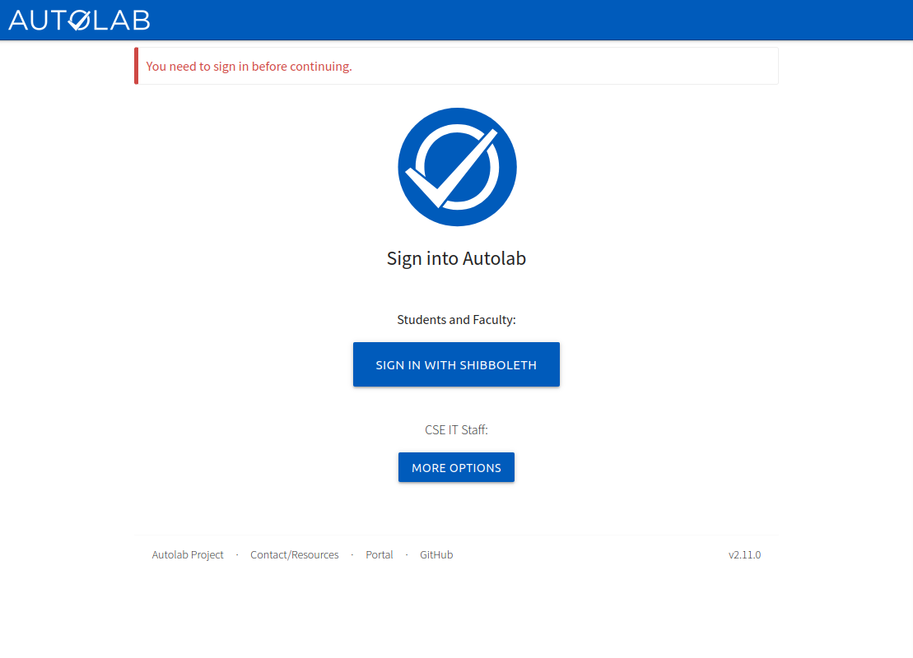
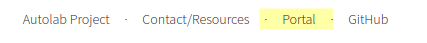
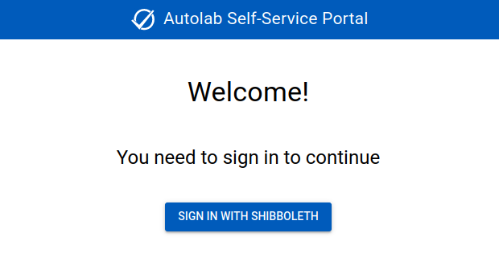
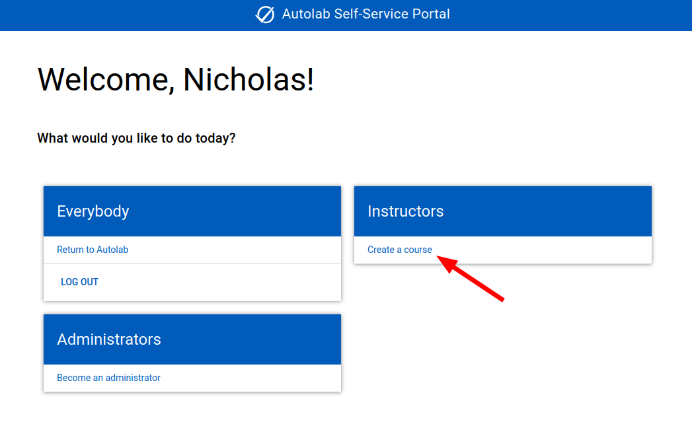
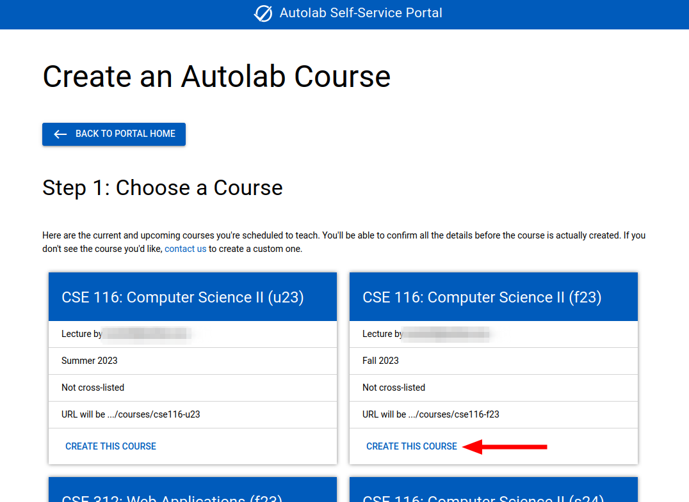
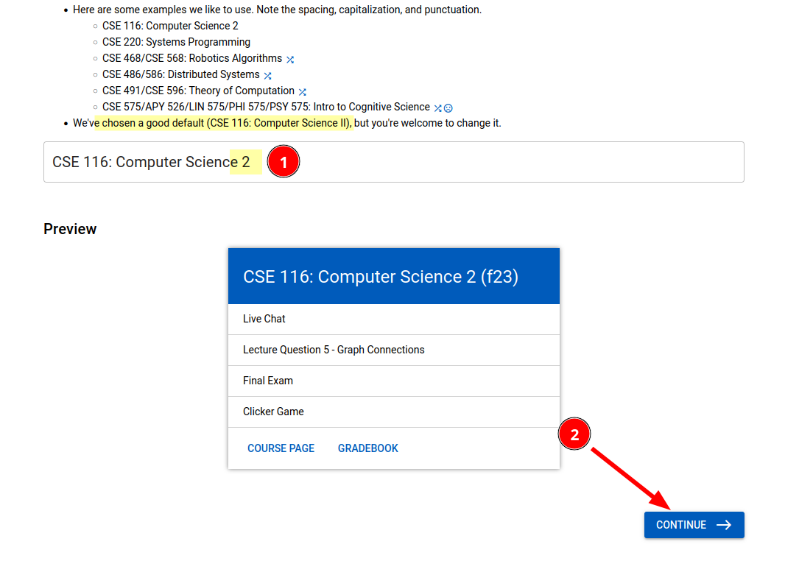
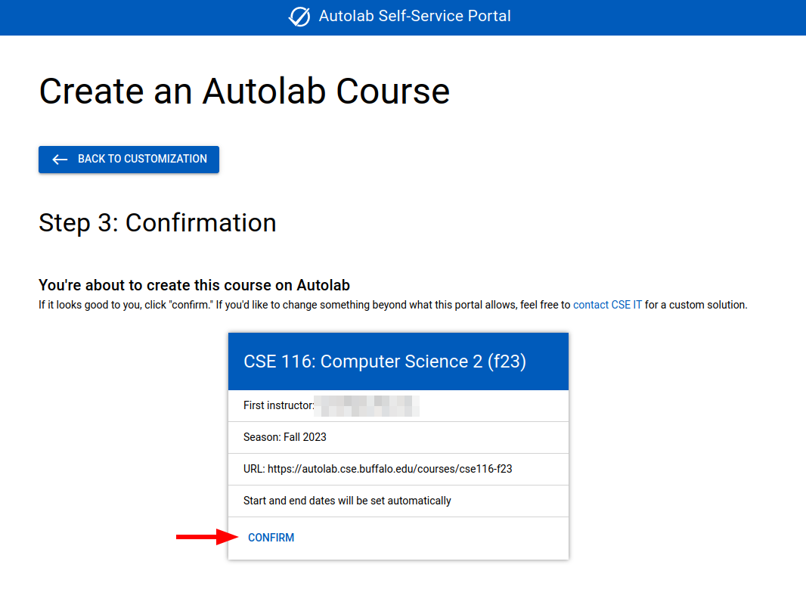
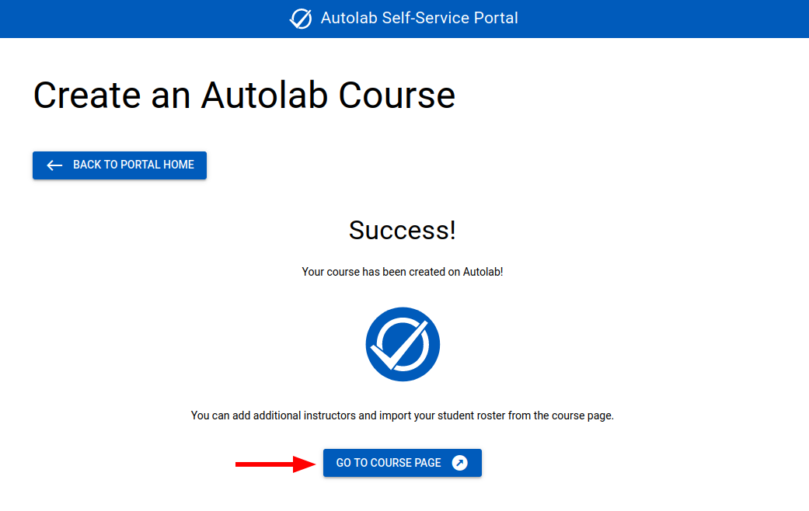
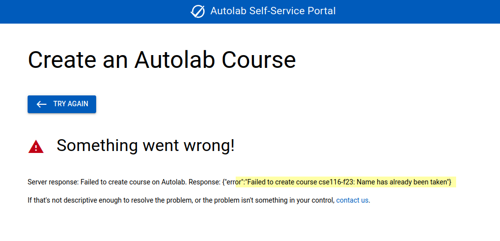

# Getting Started

## Your First Login

The first time you visit Autolab at <https://autolab.cse.buffalo.edu>, you'll be asked to sign in.

Students and faculty should choose `Sign in with Shibboleth`. You'll be redirected to the UB Single Sign On page
(shibboleth.buffalo.edu), where you can enter your standard UBIT credentials and perform a 2FA verification.

After signing in, you'll be redirected to Autolab. Since you're a new user, you probably won't be enrolled in any
courses. (Instructors can enroll students in courses before they've logged into Autolab for the first time, so you *may*
see some courses even if this is your first time logging in.)

If you're an instructor, you can [Create a Course](#create-a-course) to get started. If you're a student, you'll need to
wait for your instructor to create a course and enroll you in it.

## Create a Course

This feature is only available to instructors who have current and/or future lectures or seminars officially scheduled
by UB. If you need an Autolab course for a different purpose, please contact CSE IT.

### Visit the portal

The footer of every page contains a link to our custom Autolab [Portal](https://autolab.cse.buffalo.edu/portal/).

Visit the portal, and click `Sign in with Shibboleth`. It will probably be automatic if you've recently signed into
Autolab.

### Portal home

After signing in, you'll see a list of actions you can perform. Select `Create a course`.

### Step 1

You'll see a list of current and upcoming courses you're scheduled to teach. Find the course you want to create, and
click `Create this Course` at the bottom of the card.

> ### About Course URLs
> For consistency, the course URL is predefined based on the course name and semester. It's not customizable by the
> instructor. If a course is cross-listed, the lowest level course is used. The course URL is used for unique
> identification in different ways on the backend, so we try to refrain from deviating from this standard scheme.

### Step 2

You'll be able to customize the course name. We've chosen a good default, but you can change it if you want. We have
some guidelines and examples at the top of the page. Click `Continue` when it looks good.

### Step 3

Finally, you'll be able to confirm the course creation. If everything looks good, click `Confirm` at the bottom of the
card. Most other options can be changed later if necessary.

### Success

If everything went well, you'll see a success message. You can click `Go to Course Page` to continue in Autolab. You can
continue configuring your course with info in the [Course Management](Course%20management.md) guide.

### If there's an error

If something went wrong, you'll see an error message. If the message doesn't help you resolve it, please contact CSE IT
for assistance.

Here's an example of an error message you might see if you try to create a course that already exists. In this case,
it's likely that another instructor already created the course but hasn't added you to it yet. If you and another
instructor would like separate Autolab courses for the same course in the same semester, please contact CSE IT.
We've found that most instructors prefer to share a single course.

