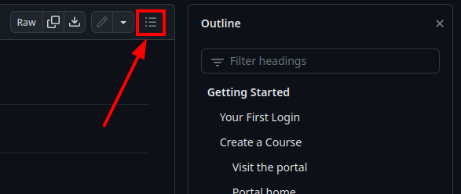

# Autolab Public Documentation

## Documentation

**This documentation is hosted in a more friendly interactive format at <https://napps.cse.buffalo.edu/docs/autolab>.**

Documentation is stored in the `docs` directory of this repository.

## Sample Autograders

Sample autograders are located in the `sample_files` directory. These are referenced throughout the documentation. Some
autograder directories contain multiple correct and/or incorrect solutions to demonstrate how the grader works in
different situations.

* [autograder0](sample_files/autograder0) is the most minimal autograder just to give you an idea of the format.
* [autograder1](sample_files/autograder1) is a more realistic autograder that grades 3 problems differently, but it's
  not robust enough for real use.
* [autograder2](sample_files/autograder2) demonstrates how to use the settings.json file to get metadata about the
  submission.
* [autograder3](sample_files/autograder3) demonstrates how to grade an embedded form submission.
* [autograder4](sample_files/autograder4) demonstrates how to create an embedded form that allows submitting a file.

## Navigation on GitHub

Individual pages don't have tables of contents. You can use the GitHub Outline feature to navigate between sections
of a document.

The [interactive version](https://napps.cse.buffalo.edu/docs/autolab) of this documentation has dynamic tables of
contents and search functionality.
