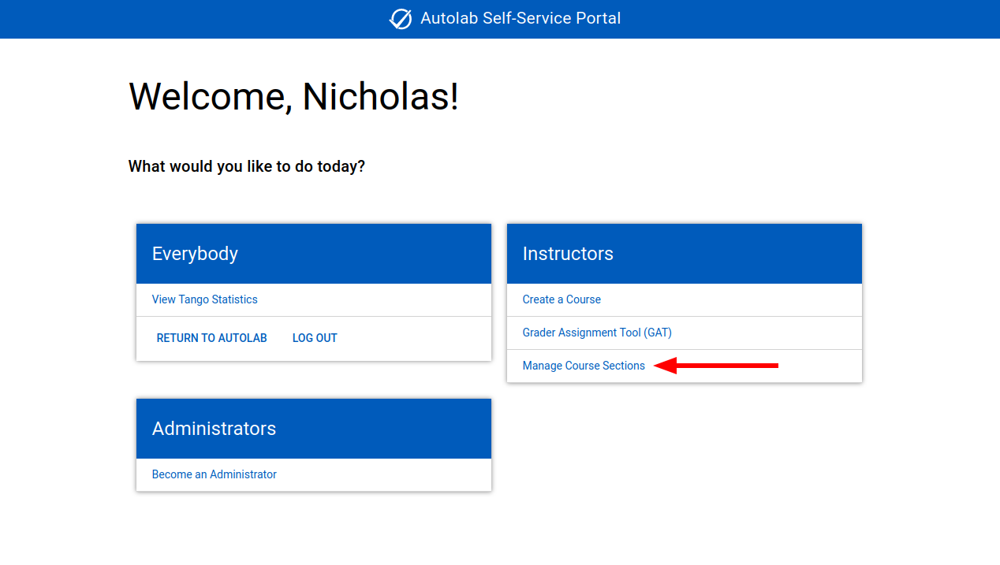
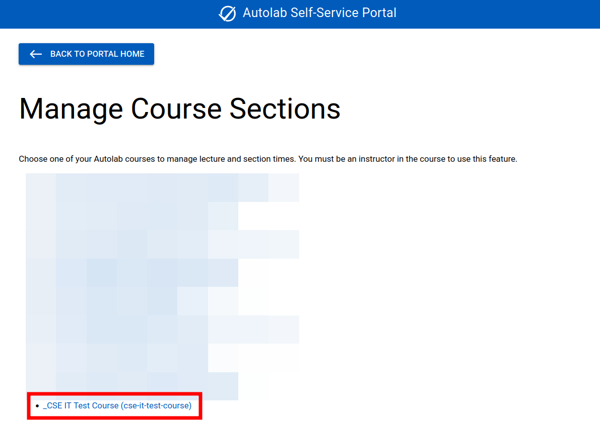
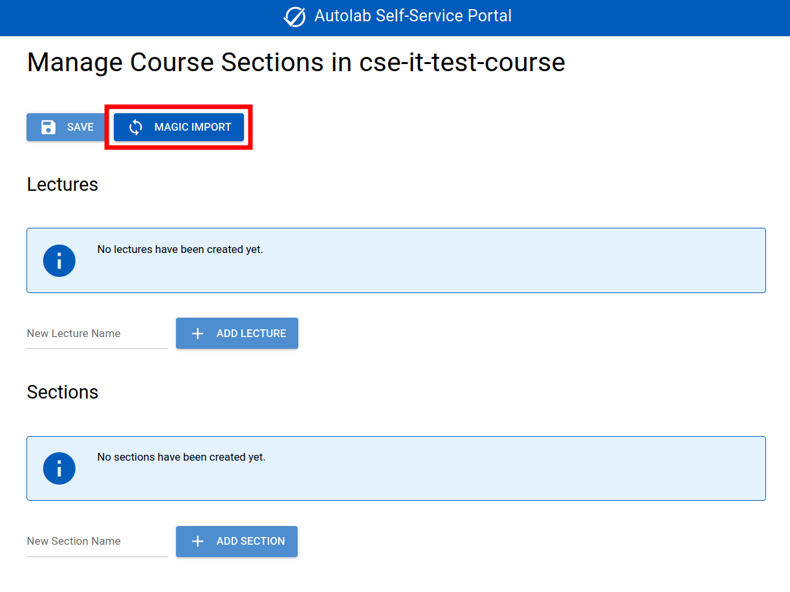
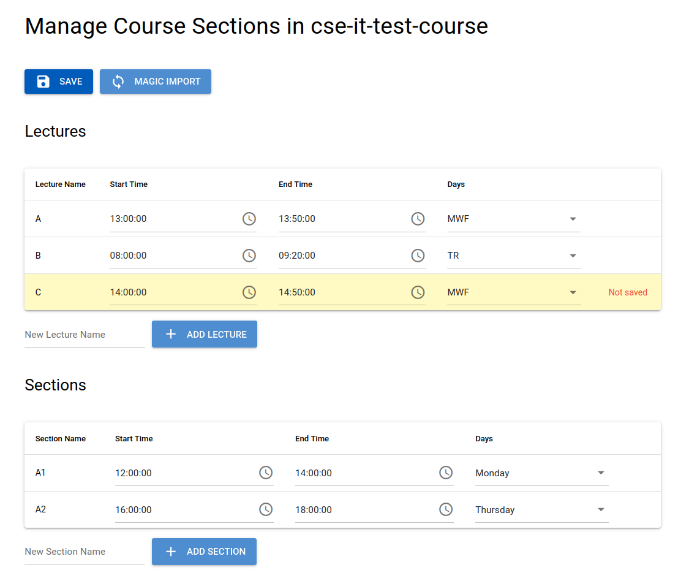
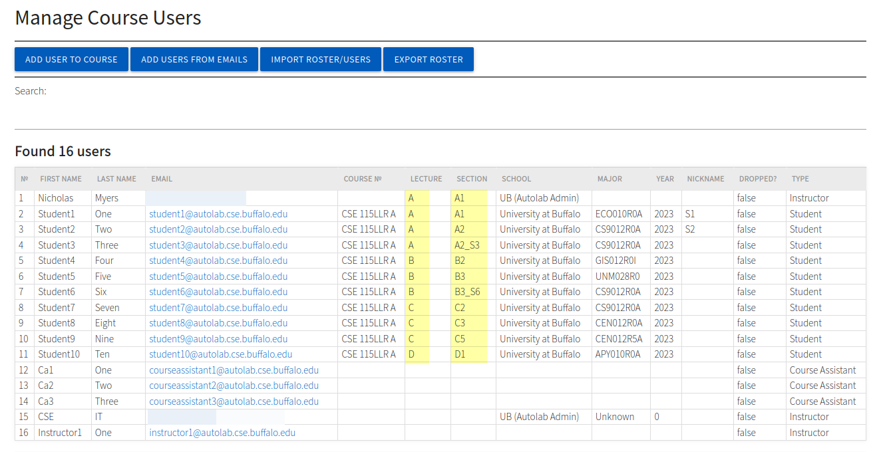
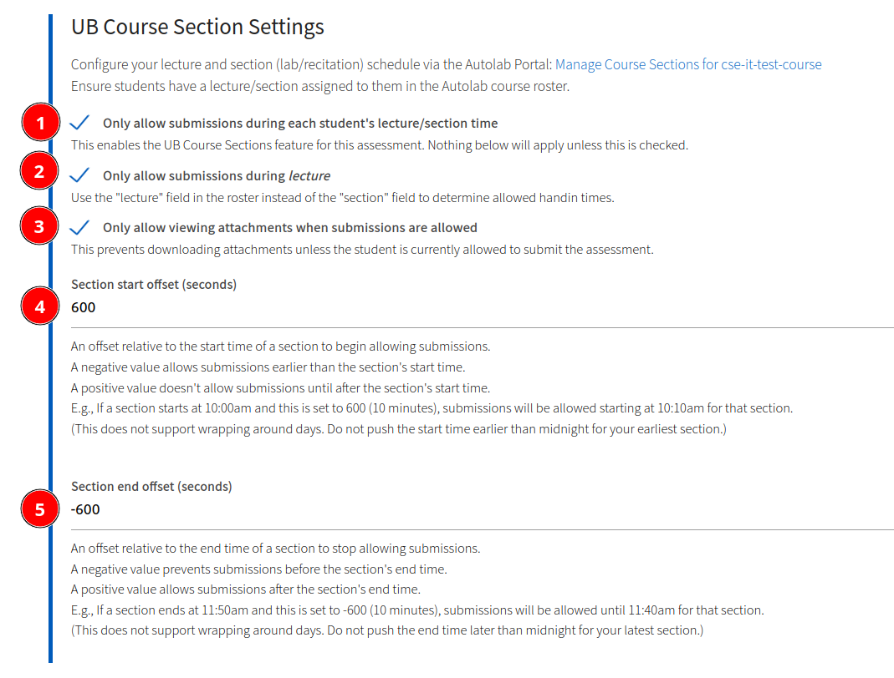
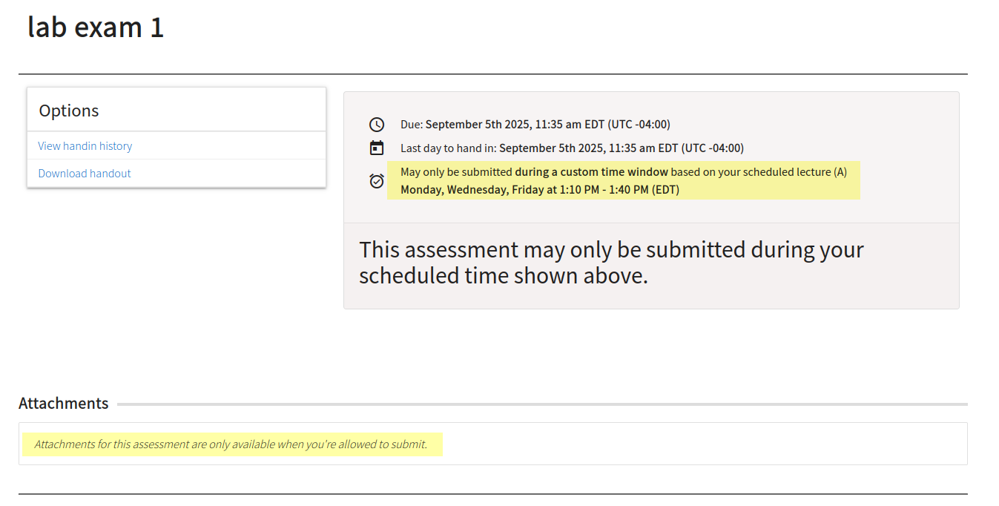
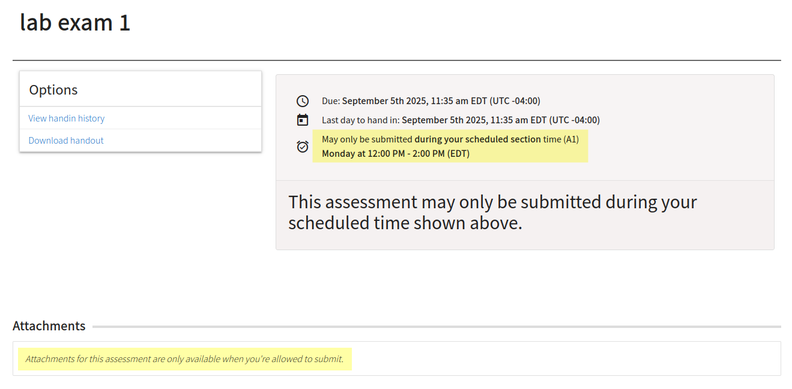

# UB Course Sections

The **UB Course Sections** Autolab feature allows you to restrict submission times in a more granular way. Submissions
can
be only allowed during a particular lecture or section meeting time. Offsets can be applied to further specify the time
each lecture/section is allowed to submit. Attachments can be restricted to only be accessible when a student is allowed
to submit.

"**Lecture**" refers to the main lecture for the course, which typically meets multiple times per week.

"**Section**" may refer to labs, recitation, or anything else you'd like to use this for, which typically meets once per
week.

This entire feature requires being an "Instructor" in the Autolab course.

## Configure your course sections

To begin using the UB Course Sections feature, you must first configure your course sections. This is done in
the [Autolab Self-service Portal](https://autolab.cse.buffalo.edu/portal/).

From the Portal home page, choose "Manage Course Sections."

Choose the course you want to configure sections for.

### Magic import

For most courses, you'll be able to click "Magic Import," which will automatically import the course sections from UB's
course database.

In this case, this sample course doesn't really exist, so we'll have to create the sections manually.

### Create a section manually

Under both the "lectures" and "sections" tables, type a lecture/section name into the "New ____ Name" field and click "
Add Lecture" (or press enter).

This will add an empty row to the table. You'll need to set the start time, end time, and days of the week for the
section. These will **not save automatically**, but the UI will make it clear that you have unsaved changes.

Tip: Click the clock icon to open a visual time picker. The time must be in 24-hour 00:00:00 format. It will always be
interpreted in the timezone we're in (not UTC), so it will remain consistent with daylight savings time.

When you're done making changes, click the "Save" button at the top.

Lecture/section names must match the ones in the Autolab roster:

## Configure an assessment

Once you've configured your course sections, you can configure an assessment to use them.

Create an assessment on Autolab. Then, navigate to the "Handin" tab of the assessment options.

Configure the assessment to your liking. Here's a numbered description of the options:

1. Check this box to enable the UB Course Sections feature.
2. Check this box to use the "lecture" field. If this isn't checked, the "section" will be used instead.
3. Check this box to only allow viewing assessment attachments during the allowed submission time.
4. Choose a section start offset time.
5. Choose a section end offset time.

Save the assessment.

## How it looks to students

Here's a student who's in lecture A, which begins at 1:00 PM and ends at 1:50 PM on Monday, Wednesday, and Friday.
The current time is Monday at 4 PM, so they're unable to submit. Here's what they'll see with the options we configured
above.

For a "lab exam," we'd want to use lab sections instead of lecture sections. This student is in section A1, which
begins at 12:00 PM and ends at 2:00PM on Monday If we set the assessment to use sections instead of lectures and reset
both offsets to 0, here's what the student would see:

The `Manage Course > Act as user` feature may be helpful for testing your configuration.

When the student is allowed to submit, they'll see the regular handin page.
