# Course Management

## Viewing Your Courses

The Autolab homepage will redirect you to https://autolab.cse.buffalo.edu/courses if you're enrolled in at least one
course. From here, you can see current, completed, and upcoming courses that you're involved in. You won't see courses
where you're not enrolled as an instructor, teaching assistant (Autolab refers to this as CA: "Course Assistant") or
student. You can click on the blue banner or the "Course Page" button to go to the course page. There's also a shortcut
button to jump immediately to the gradebook.

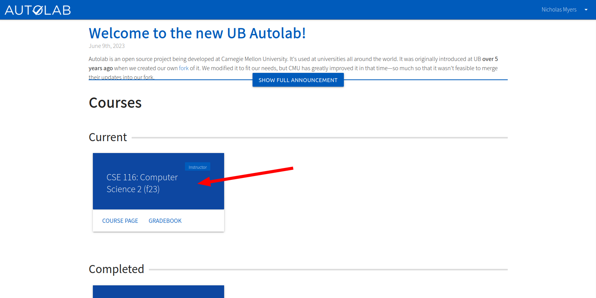

If you're an instructor or CA, you'll see a badge on the top right of the course. Above, you can see that I'm an
instructor since I just created this course by following the steps
in [Getting Started > Create a Course](Getting started.md#create-a-course). Below is what a CA will see. We'll cover
enrolling students, CAs, and additional instructors shortly.

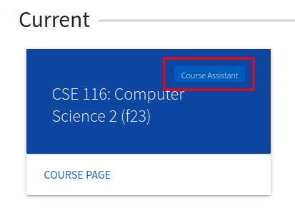

Students will not see a badge:

## Course Page

Navigate to your course page, and you'll see the empty course dashboard.

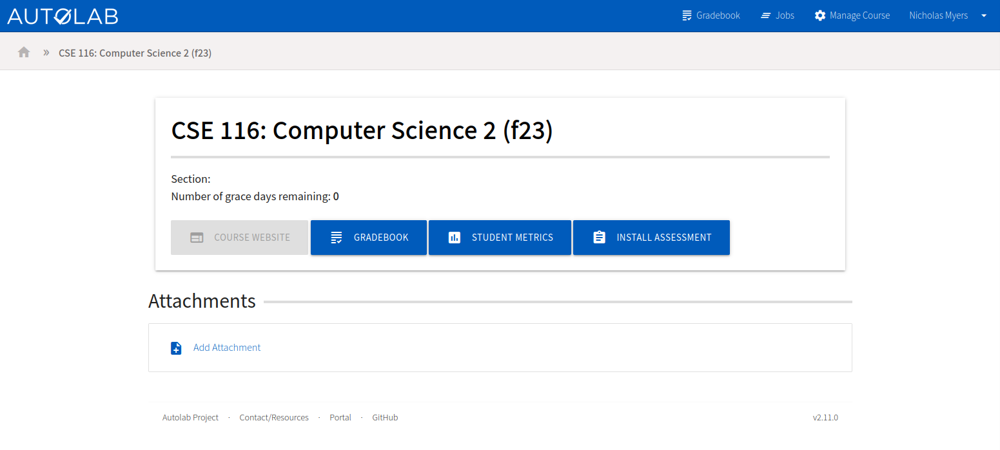

## Manage Course

Let's start configuring the course. Click the `Manage Course` button on the navigation bar. Here's what you'll see:

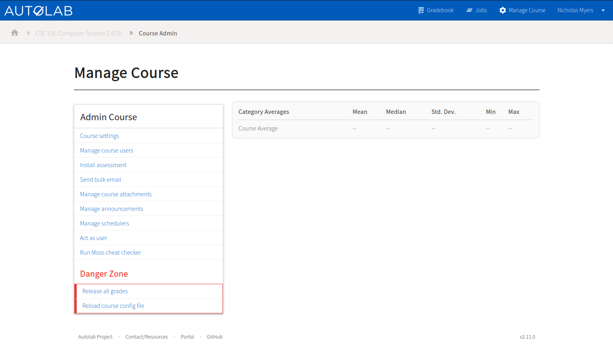

This will be referred to as the "Manage Course" page throughout the documentation.

## Course Settings

From the manage course page, click `Course settings` to configure the general settings for the course. You can look
through all the options, but the default values are reasonable for most courses. Each option has hint text below it to
explain what it does.

The one thing I'd recommend doing now is adding your course homepage URL to the "Website" field. This will enable the
"Course Website" button on the course dashboard.

When you're done tweaking the settings, click `Save` at the bottom of the page. I won't keep mentioning this throughout
the documentation, but note that you'll need to click `Save` on most pages to save your changes.

## Enrolling Students

From the manage course page, click `Manage course uesrs`. You'll see a list of all the users enrolled in the course.
This will initially just be you and some CSE IT staff members.

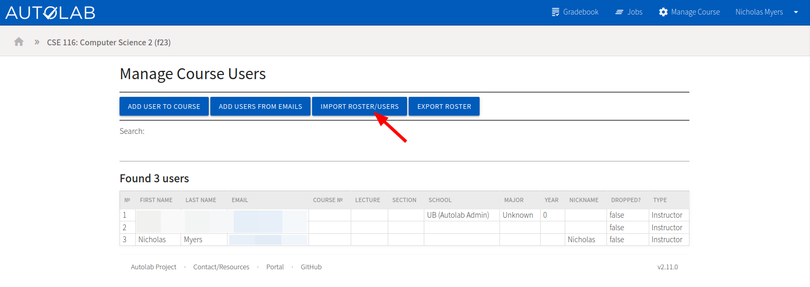

Click `Import Roster/Users` to import a roster of students. You'll see a page with instructions for formatting a CSV to
import, but CSE IT already has a tool that will build this CSV file for you. I'll walk through using that.

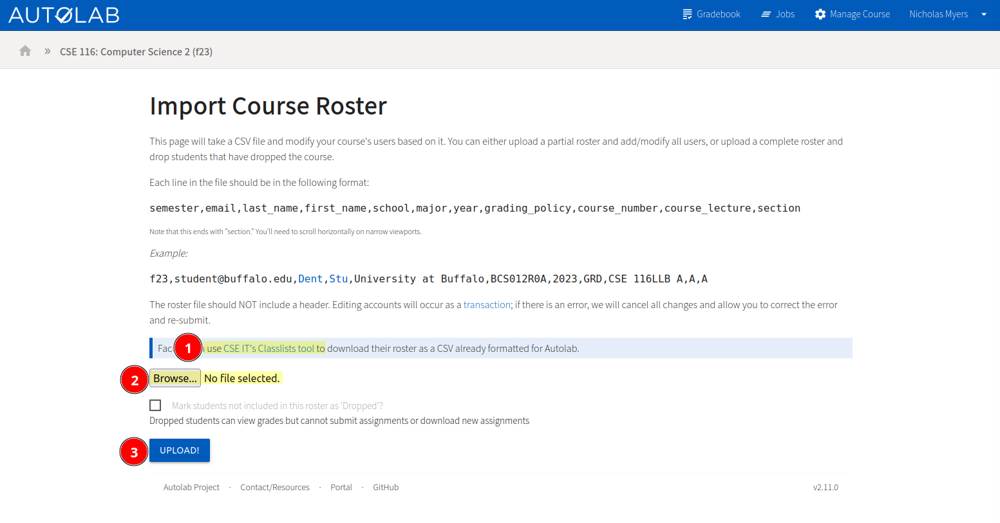

### Using the CSE IT Classlists Tool

(Using this tool is not required. You can manually create a roster CSV file by following the format on the import page.)

Click the [CSE IT's Classlists tool](https://cse.buffalo.edu/apps/classlists) link on the page. Note that only CSE
faculty and staff can access this tool.

1. Select the term
2. Choose to either only show your classes or all classes. You may need to show all classes if you and another
   instructor are co-teaching a course.
3. Click next

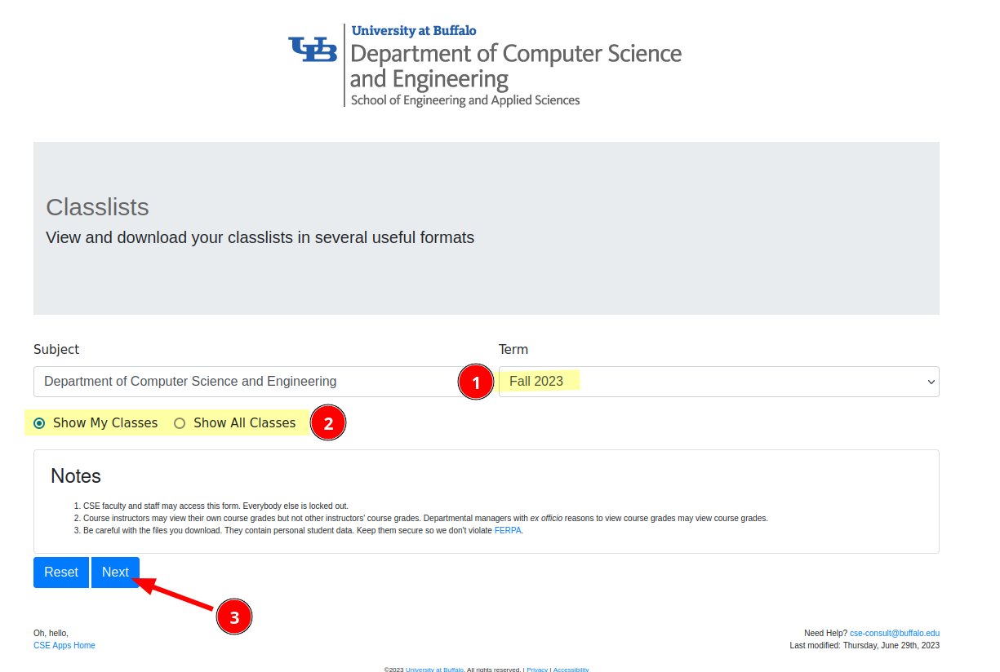

Select the course you want the roster for, then scroll down and click `Next`.

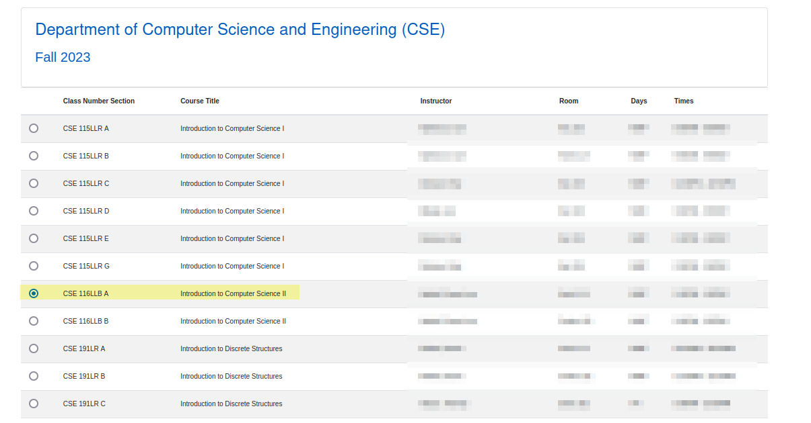

1. Select the "AutoGrader Inputs" tab
2. Click the blue button, which includes all sections of the course, to download the CSV file.

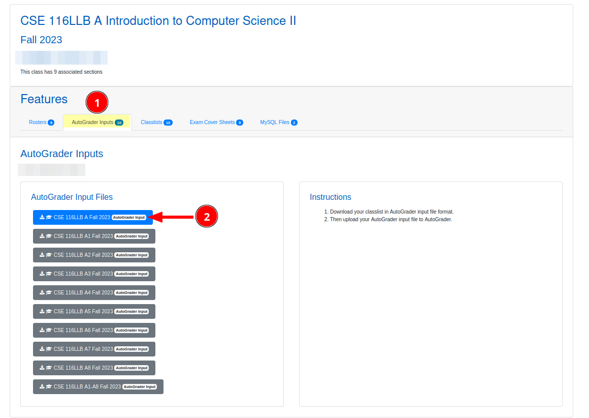

Go back to the Classlists tool and repeat the steps to download a CSV for each main section of the course.

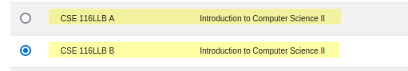

### Uploading a CSV file

Unfortunately, we can only upload one CSV file at a time, so this process will need to be repeated for each CSV file.

Once you've downloaded or otherwise obtained a CSV file, go back to the Autolab import page and click the `Browse`
button, and then the `Upload` button to upload the CSV files.

Review the changes that will be made, and then click `Confirm` if the data looks correct.

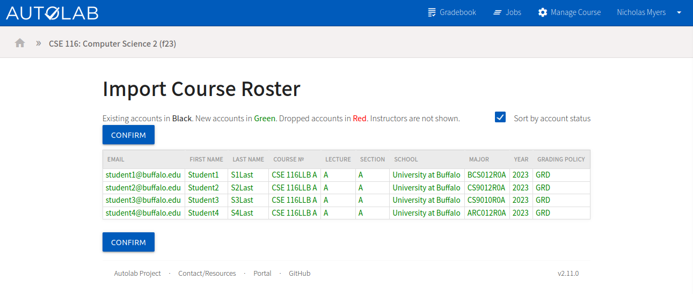

Now you'll see the full roster with the new students added.

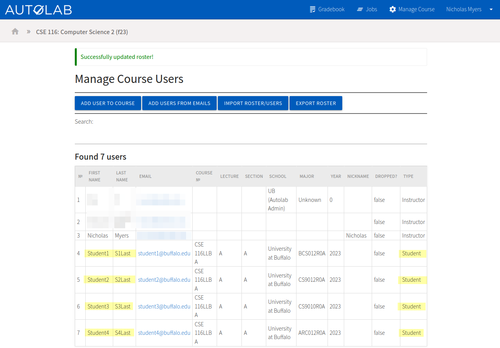

## Enrolling Teaching Assistants

Navigate to the "Manage Course Users" page.

1. Click `Add Users from Emails`.
2. Enter the Buffalo email addresses of the TAs you want to add, one per line.
3. Choose either "Course Assistant" or "Instructor" for their role.
    * Instructors have full access to the course, equivalent to yours (assuming you're the instructor who created this
      course).
    * CAs can only assign scores to problems.
4. Click `Submit`.

You'll see the TAs added to the roster.

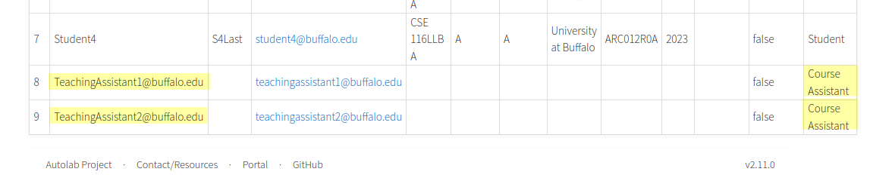

> ### Side Note on Autolab Accounts
> In this example, the accounts don't really exist, so the names are incorrect/missing.
> * If the TA already has an Autolab account, which is highly likely, the data will be correct.
> * If the TA doesn't have an Autolab account, their information will automatically be updated when they sign in for the
    first time.
> * The same applies to students if you create their accounts this way (without the CSV), but fields like the lecture
    and section won't be filled. It's highly recommended to enroll students with the CSV import feature.

## Additional Course Management Features

From the manage course page, you can notably also:

* **Manage course attachments** to provide students with files
* **Manage announcements** to show students a short message on the course dashboard
* **Act as another user** to see what the course looks like from their perspective
* **Run Moss cheat detection** to look for similar code submissions between students

## What's Next?

Now that you've created a course and enrolled students, you'll probably want
to [Create an Assessment](Create an assessment.md).