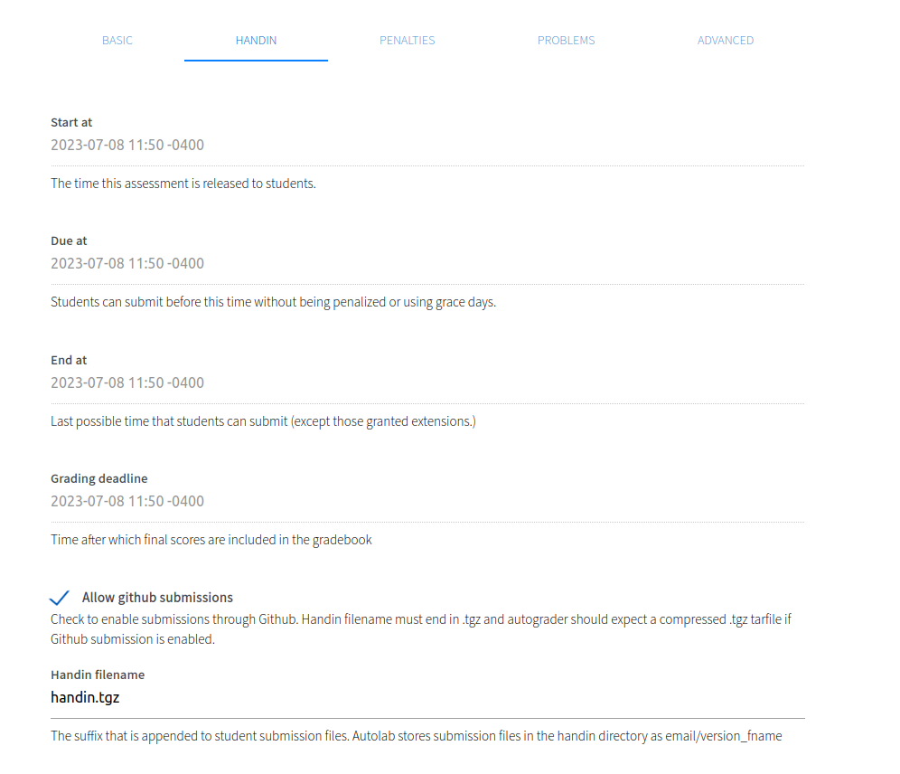
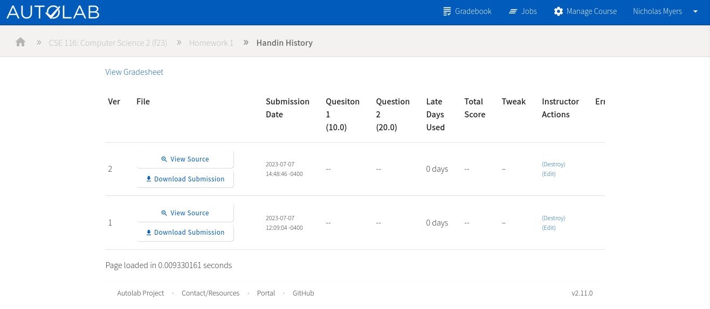
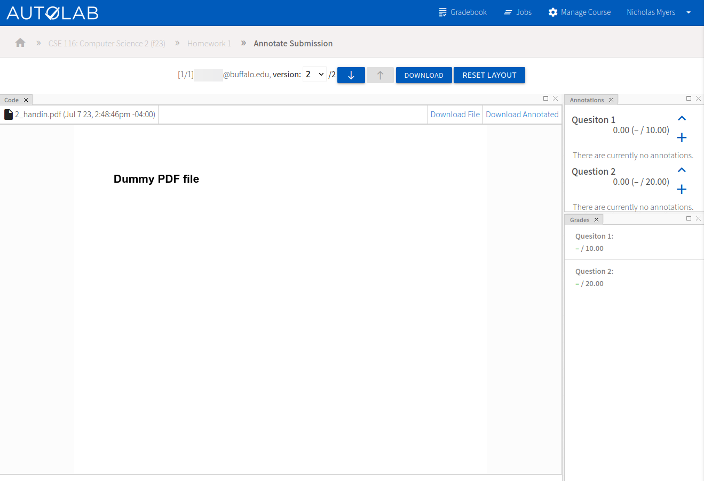
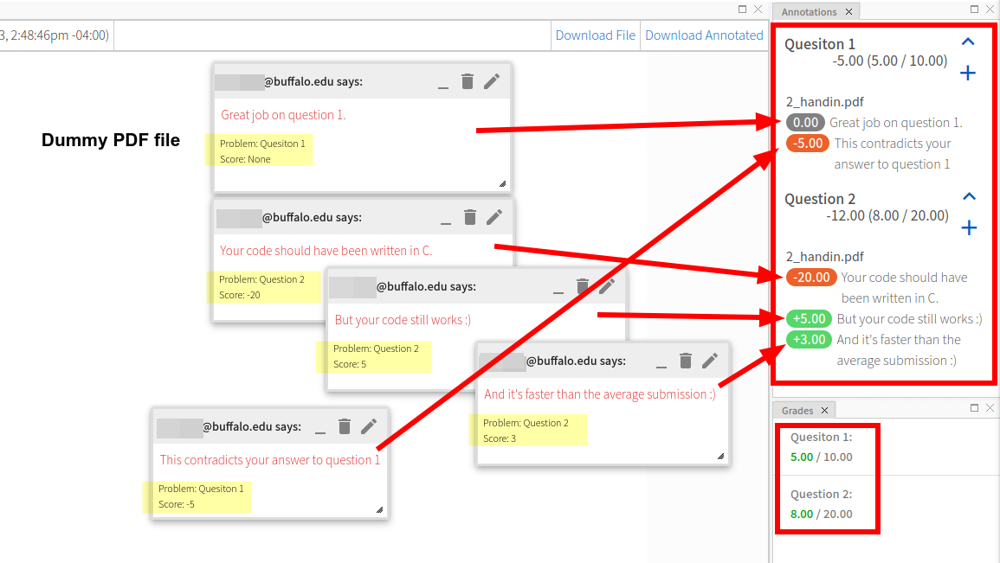

# Create an Assessment

An Autolab assessment is a graded assignment that students can hand in. They can be used for homework, labs, exams, and
more. They can be manually graded or automatically graded.

## Install Assessment

Navigate to your course dashboard and click `Install Assessment`.

You'll see the various ways you can add an assessment to your course.

### Import from tarball

If you have an assessment from a previous semester, you can export it from the previous course as a tarball and then
import it here. Just click `Browse` and select the tarball.

> ### Side note about "import from file system"
> This feature is only accessible to users who have direct access to the Autolab server, which essentially means we
> don't use it. If there's a particular need for this, contact CSE IT.

### Create from scratch

This is how assessments should be initially created. Click the "Assessment Builder" link to begin.

1. Choose the assessment name, which is what students will see. Naming it something more specific than "Homework 1" is
   recommended. Something like "Homework 1: HTTP Basics" may be more identifiable to students.
2. Choose the assessment category. If you already have categories defined, you can choose one of those from the
   dropdown. Otherwise, you can create a new category by typing in a new name. Categories are used to group assessments.
   Popular categories include Homework, Labs, Exams, and Projects. Separating assessments into categories is useful for
   weighted grading if you want to use some advanced features of Autolab. Otherwise, it's just good for organization.
3. Click `Create Assessment`.

You can change any of these settings later, except for the URL, which will be automatically generated based on the
display name you choose.

## Assessment Page

After creating an assessment, you'll be brought to the assessment page. You have a lot of options here.

## Edit Assessment

Let's start by looking at everything you can customize about the assessment. Click `Edit Assessment` at the top of the "
Admin Options." Here's an overview.

### Basic

The "basic" tab allows you to edit the values you chose while creating the assessment and change some other display
options. They're fairly self-explanatory with the help text below each option. The ability to upload a custom Ruby
file for the assessment is advanced, so you can ignore that for now.

### Handin

The "handin" tab allows you to configure the start, due, end, and grading deadline dates for the assessment. You can
choose if students are allowed to submit directly from a GitHub repo, change the handin filename, set the maximum
submission size, and disable handins. Each of these is explained in the help text below the option.

> ### The `Handin filename` field is important
> * It doesn't matter what the file is named on a student's computer; it will be renamed to the handin filename when
    they upload it.
> * If you're using an automatic grader, this is the name of the file that will be accessible in the grading VM.
> * Students will be warned before uploading a file that doesn't match the handin filename's extension.

### Penalties

The "penalties" tab allows you to configure the maximum submissions limit and reduce scores on late submissions.

### Problems

The "problems" tab allows you to add problems to the assessment, which are the actual "questions" students will answer
and receive points for. We'll add some to our new assessment after this overview.

### Advanced

The "advanced" tab allows you to configure student groups, embedded HTML forms, and an assessment dependency.

The official Autolab [Embedded Forms documentation](https://docs.autolabproject.com/features/embedded-forms/) is a good
reference.

**Assessment dependencies** are a custom UB feature. You can select a different assessment that must be completed with
at least the selected minimum score before this assessment can be submitted to. Select "(None)" to disable.

## Add Problems

Now that we've looked at the assessment settings, let's add some problems. Navigate to the "Problems" tab and
click `Add Problem`.

1. Name the problem. This is what students will see. You'll also use this name in your autograder output.
2. Set the maximum score possible for this problem.
3. Click `Save Problem`. All settings can be changed later.

You can optionally set a description or make the problem optional.

I've gone ahead and created another problem, so we can see both in the problems list.

Now the assessment is ready for students to submit to. We'll need to get some student submissions before we can grade
them. You can also make submissions as an instructor, which is useful for testing.

## Make a Submission

(I've updated the assessment start and end date so that we can make a submission in the expected timeframe and not have
to deal with late days. I also updated the handin filename to "handin.pdf" to indicate that we want a PDF submission
from students.)

Navigate to the assessment page.

1. Select (or drag and drop) a file to upload.
2. Affirm that you're complying with the academic integrity policy.
3. Click `Submit`.

You'll be redirected to the list of your submissions.

## View, Annotate, and Grade a Submission

### View a submission

To view, annotate, and/or grade a submission, click the `View Source` button on it.

You'll be able to see the submission rendered in the browser. You can also download the submission and navigate between
submissions and different students with the buttons at the top.

### Annotate a submission

You can click somewhere on the submission to create an annotation and assign a grade. Students will be able to review
this to learn why they were scored the way they were.

In a code submission, you can create annotations per line. In a PDF submission, you can create annotations anywhere.

You need to assign a score and question to each annotation. The way it affects the student's score will depend on the
grading mode you selected in the problems tab of the assessment settings.

Recall we're using the "Negative Grading" mode, which is the default value. This means that assigning a score of 0
(or `None`) is perfect; it *reduces* the score by 0. If we wanted to reduce the score, we could assign a negative score.

In the "positive grading" mode, the student starts with a score of 0 and annotations *add* to the score.

### Assign a grade by annotation

Now you can create one (or more) annotations per problem to assign scores. You'll see the totals computed on the right
sidebar. Unlike most things in Autolab, it's saved immediately after adding the annotation.

### Stacking annotations

We can combine various positive and negative scores to create a final score for the problem. Maybe a student missed part
of the question but answered another part exceptionally well.

