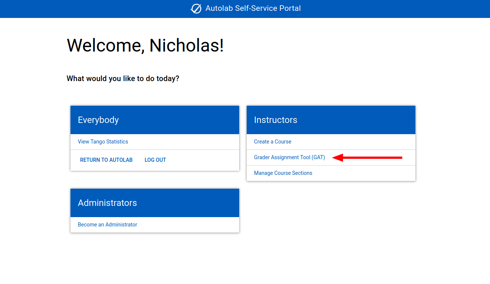
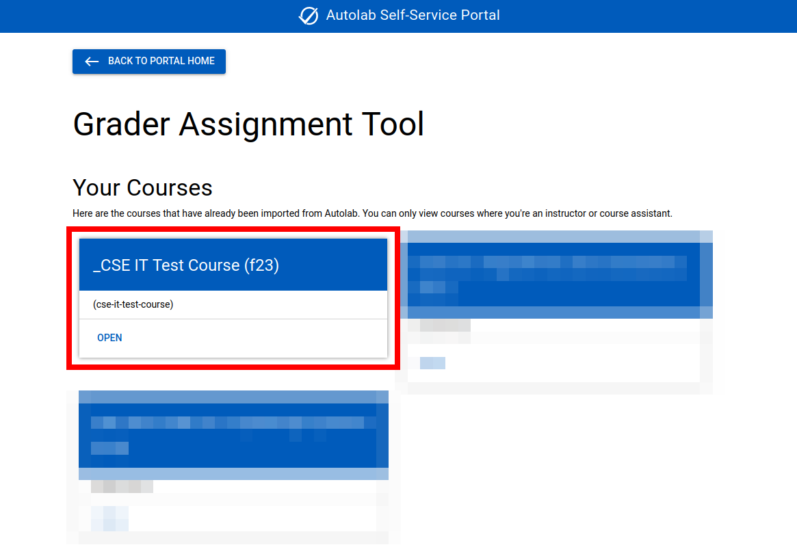
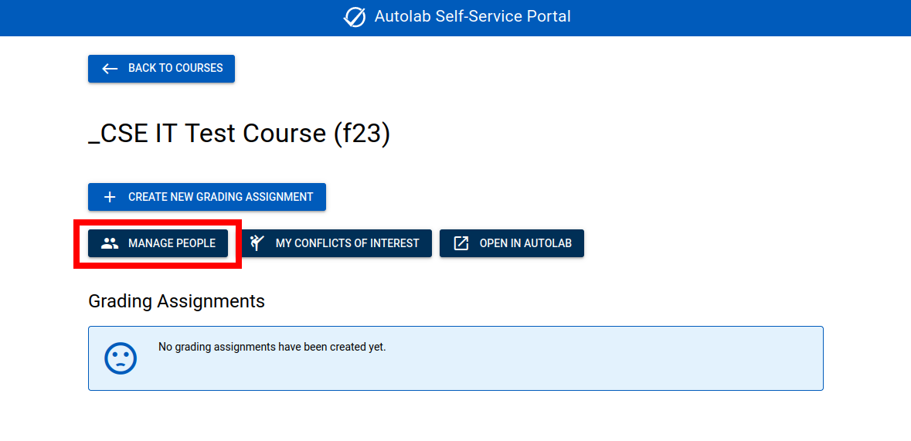
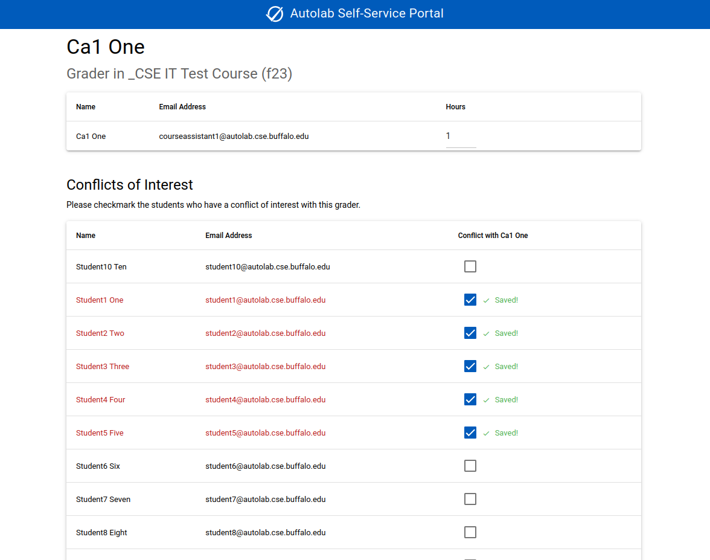
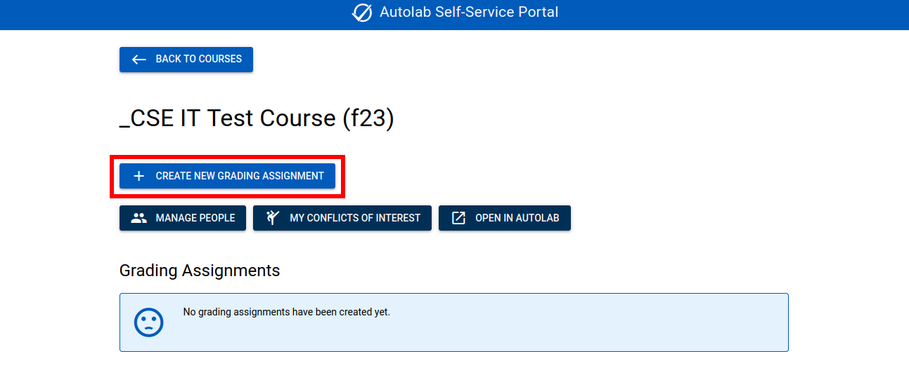
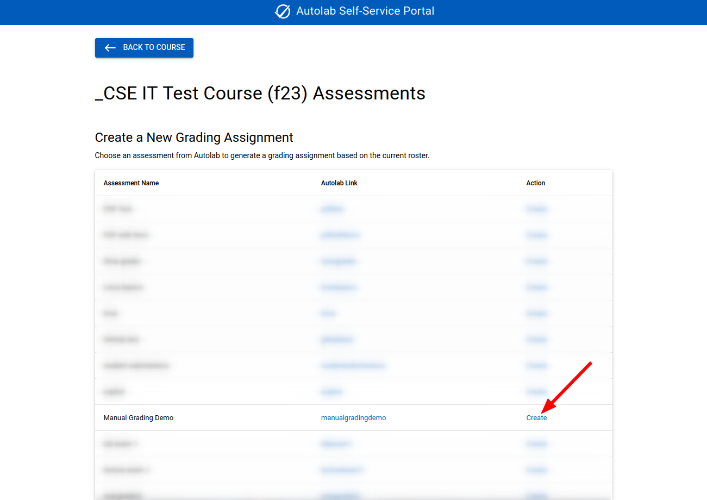
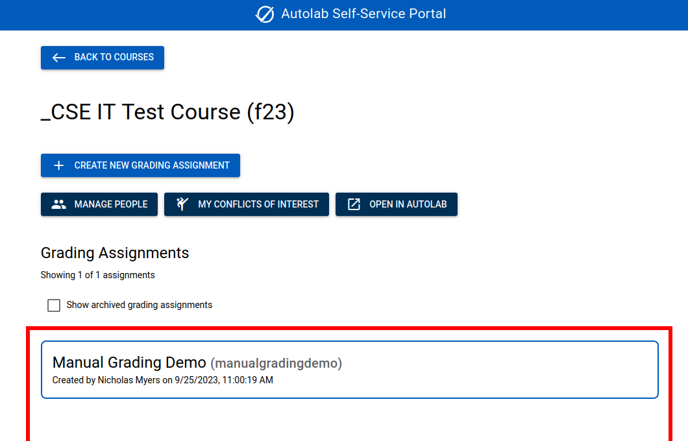

# Grader Assignment Tool (GAT)

The **Grader Assignment Tool** is a custom UB application that allows instructors to assign a grader to each student's
latest
submission. It accounts for how many hours each grader works and which students each grader has a conflict of interest
with.

## Accessing the GAT

The GAT is accessible via the [Autolab Self-service Portal](https://autolab.cse.buffalo.edu/portal/).

## Import your course from Autolab

The GAT is a completely separate application from Autolab, so you'll need to import your course to start using it.

From the GAT index page, click the "Import from Autolab" button.

This will list all the courses you're enrolled in on Autolab. Find the course you want to import, and click the "Import
from Autolab" button.

You can only import courses where you're an instructor or course assistant. The entire GAT system treats instructors and
course assistants equally. Both are considered "graders" and have the same access level to the whole tool.

Then, you can open the course with the convenient button that will appear after importing. Your new course will also be
available at the top of the page.

## Manage people

From the GAT course page, click the "Manage People" button.

The "Manage People" page will show the graders and students in your course.

You can assign how many hours each teaching assistant will work here. This is effectively just a weight for how many
students they'll be assigned, so it doesn't strictly need to be in hours. You can assign yourself 0 hours to not
be assigned any students to grade.

The whole GAT application is designed to feel modern, so you can type in a number and it will automatically save.

If you change your course roster on Autolab, you can click the "Sync Roster from Autolab" button to update the GAT
roster. This will update both names and roles. Name updates work retroactively after creating a grading assignment.
If new graders are added or removed, it will NOT update previously generated grading assignments.

## Manage conflicts of interest

There are two ways to access conflicts of interest:

1. From the manage users page, click the "COI" link in someone's row to view a particular person's conflicts of
   interest.
2. From the GAT course page, click the "My Conflicts of Interest" button to view your own conflicts of interest.

The conflicts of interest page for a particular user lists everyone in the course that the person could have a
conflict of interest with. If the person is a grader, it will list the students, and vise versa.

You should have each of your graders fill out their own conflicts of interest before creating any grading assignments.
They can do this by checking the box on each student they have a conflict of interest with. Changes are saved
immediately. Graders will not be assigned to grade any students they have a conflict of interest with.

## Create a grading assignment

Once the roster is imported and conflicts of interest are filled out, you can create a grading assignment.

A **grading assignment** is a mapping of graders to students for a particular assessment. Once a grading assignment is
created, it cannot be changed. If you realize you generated a grading assignment with incorrect information, you can
archive it and generate a new one. Nothing is ever permanently deleted to prevent data loss.

Since grading assignments won't change after creation, you should not generate one until everybody has submitted
their work to Autolab&mdash;usually after the due date. If a student makes a submission after the grading assignment
is created, that submission will not be considered. (A previous submission from the same student will still be
included if it was made before the grading assignment.)

From the GAT course page, click the "Create New Grading Assignment" button.

You'll see a list of all the Autolab assessments in your course.

You can view the assessment on Autolab by clicking the "Autolab Link" in the assessment's row. Click the "Create" link
to create a grading assignment for that assessment. You'll need to confirm creation on the next page.

If this succeeds, then you can click the grading assignment to view it. If there was an error, it will tell you what
went wrong.

## View a grading assignment

On the GAT course page, you'll see a list of grading assignments. The newest ones are towards the top. Archived grading
assignments are hidden by default, but you can show them with the "Show archived grading assignments" checkbox. Click
one of the grading assignments to view it.

The grading assignment page will show you general information about the grading assignment, including:

- Who created it
- When it was created
- The unique ID
- A link to the Autolab assessment page

The rest of the page lists each grader and the student submissions they're assigned to grade.
The person viewing the page will always be shown first if they have students to grade.

You can see the 3 graders were assigned different numbers of students according to their hours. The first grader, Ca1
One, has conflicts of interest with students 2-5, so they weren't assigned to them. Student5 didn't submit this
assessment, so they weren't assigned to a grader.

Each row includes a link to the student's submission on Autolab, which mentions which version the submission is. Each
grader can go through their list of students, click the link to their submission, grade the submission on Autolab, come
back to the GAT page, and then check the "Complete" checkbox. Only the assigned grader can mark their own students as
complete. GAT does not make any modifications on Autolab, and it doesn't handle scores.

You, as the instructor, can view your graders' progress on this page. As graders complete their assignments, their count
will increase and the complete rows will be shaded. Once a grader has finished all their assignments, the entire table
will turn gray, and a green "Complete" checkmark will appear.

## Archive a grading assignment

Once a grading assignment is complete, you can archive it.

To archive a grading assignment, check the "Archive" checkbox on the grading assignment page. It will turn gray and
add an "Archived" label. This will hide it from the course page by default to avoid clutter.

Archived grading assignments can still be modified (by marking assignments as complete), and they can always be
unarchived.
